```mermaid
classDiagram
    direction LR

    %% =================================================================
    %%  v4 — TARGET / REDESIGN model (round 6; converged; not yet
    %%  implemented). Captures the operator's renaming + restructure
    %%  with all resolutions across six review rounds (61 points
    %%  total). Sign-off pending.
    %% =================================================================

    %% --- Aliases / supporting value objects ---
    class Timestamp {
      <<value>>
      +Date moment
    }
    class Weight {
      <<value>>
      +Number value
    }
    class TimestampedValue~T~ {
      <<value>>
      +Timestamp at
      +T value
    }
    class Objective~T~ {
      <<value>>
      +Timestamp at
      +T value
    }
    class Direction {
      <<enumeration>>
      ASCENDING
      DESCENDING
      FLAT
    }

    %% --- Domain-side ports / capability interfaces ---
    class Clock {
      <<interface>>
      +now() Timestamp
    }
    class Comparator~T~ {
      <<interface>>
      +compare(T a, T b) Number
    }
    class Ranged~T~ {
      <<interface>>
      +T minimalValue
      +T maximalValue
      +compare(T a, T b) Number
      +direction() Direction
      +contains(T v) Boolean
      +requireValue(T v) void
    }

    %% --- Comparator singletons (§5) ---
    class NumericComparator {
      <<singleton>>
      +compare(Number a, Number b) Number
    }
    class LexicographicComparator {
      <<singleton>>
      +compare(String a, String b) Number
    }

    %% --- Errors ---
    class OutOfRangeError {
      <<Error>>
    }
    class EmptyHistoryError {
      <<Error>>
    }
    class TimestampNotFoundError {
      <<Error>>
    }

    %% --- Tree container ---
    class Tree {
      +Node root
      +findById(String id) Node?
      +nodes() readonly Node[]
    }

    %% --- Node hierarchy ---
    class Node {
      <<abstract>>
      +String id
      +String title
      +Weight weight
      +Node parent
      +readonly Node[] children
      +attach(Node child) void
      +detach(Node child) void
    }
    class ValueNode~T~ {
      <<abstract>>
      +String description
      +getValue()* T
      +getDescription() String
    }
    class HistorizableValueNode~T~ {
      <<abstract>>
      -TimestampedValue~T~[] history
      -Clock clock
      +entries() readonly TimestampedValue~T~[]
      +getValue() T
      +setValue(T v) void
      +addValue(Timestamp t, T v) void
      +removeValue(Timestamp t) void
    }
    class TextNode {
      +getValue() String
    }
    class RangedValueNode~T~ {
      <<abstract>>
      +Range~T~ range
      +addValue(Timestamp t, T v) void
    }
    class BusinessScoreNode~T~ {
      +LenientRange~T~ range
      +Objective~T~ objective
    }
    class StrictRangeNode~T~ {
      +StrictRange~T~ range
    }

    %% --- Range hierarchy (Object Calisthenics: flag → polymorphism) ---
    class Range~T~ {
      <<abstract>>
      +T minimalValue
      +T maximalValue
      -Comparator~T~ comparator
      +compare(T a, T b) Number
      +direction() Direction
      +contains(T v) Boolean
      +requireValue(T v)* void
    }
    class StrictRange~T~ {
      +of(T min, T max, Comparator~T~ cmp)$ StrictRange~T~
      +requireValue(T v) void
    }
    class LenientRange~T~ {
      +of(T min, T max, Comparator~T~ cmp)$ LenientRange~T~
      +requireValue(T v) void
    }

    %% --- Visual layer (Card<N extends Node>) ---
    class Card~N~ {
      <<abstract>>
      +N node
      +getNode() N
    }
    class TextCard {
      +TextNode node
      +getNode() TextNode
    }
    class BusinessScoreCard~T~ {
      +BusinessScoreNode~T~ node
      +getNode() BusinessScoreNode~T~
    }
    class StrictRangeCard~T~ {
      +StrictRangeNode~T~ node
      +getNode() StrictRangeNode~T~
    }

    %% --- Composition ---
    Node                       *-- "1"    Weight
    Tree                       *-- "1"    Node                : root
    TimestampedValue~T~        *-- "1"    Timestamp           : at
    Objective~T~               *-- "1"    Timestamp           : at
    HistorizableValueNode~T~   o-- "0..*" TimestampedValue~T~ : history
    BusinessScoreNode~T~       *-- "1"    LenientRange~T~     : range
    BusinessScoreNode~T~       *-- "1"    Objective~T~        : objective
    StrictRangeNode~T~         *-- "1"    StrictRange~T~      : range
    Range~T~                   *-- "1"    Comparator~T~       : comparator

    %% --- Tree shape (self-association maintained by attach / detach) ---
    Node "0..1" o-- "0..*" Node : children / parent

    %% --- Inheritance (Node tree) ---
    Node                     <|-- ValueNode~T~
    ValueNode~T~             <|-- HistorizableValueNode~T~
    HistorizableValueNode~T~ <|-- TextNode
    HistorizableValueNode~T~ <|-- RangedValueNode~T~
    RangedValueNode~T~       <|-- BusinessScoreNode~T~
    RangedValueNode~T~       <|-- StrictRangeNode~T~

    %% --- Inheritance (Range tree) ---
    Range~T~ <|-- StrictRange~T~
    Range~T~ <|-- LenientRange~T~

    %% --- Inheritance (Card tree) ---
    Card~N~ <|-- TextCard
    Card~N~ <|-- BusinessScoreCard~T~
    Card~N~ <|-- StrictRangeCard~T~

    %% --- Realization ---
    Range~T~                  ..|> Ranged~T~
    NumericComparator         ..|> Comparator~T~
    LexicographicComparator   ..|> Comparator~T~

    %% --- Card -> Node wiring (hosting, not inheritance) ---
    TextCard             *-- "1" TextNode             : node
    BusinessScoreCard~T~ *-- "1" BusinessScoreNode~T~ : node
    StrictRangeCard~T~   *-- "1" StrictRangeNode~T~   : node

    %% --- Injected dependencies ---
    HistorizableValueNode~T~ ..> Clock : injected at construction

    %% --- Errors raised by the API ---
    HistorizableValueNode~T~ ..> EmptyHistoryError         : getValue() if history is empty
    HistorizableValueNode~T~ ..> TimestampNotFoundError    : removeValue(t) if no entry at t
    StrictRange~T~           ..> OutOfRangeError           : requireValue(v) if !contains(v)
    RangedValueNode~T~       ..> OutOfRangeError           : addValue() — propagates from range.requireValue
```

# v4 class diagram — IDE preview wrapper (SPEC §17.57)

This file is the **IDE-preview companion** of [`classDiagramMermaid.v4.mermaid`](./classDiagramMermaid.v4.mermaid).

Cursor / VS Code render Mermaid blocks inside Markdown previews out-of-the-box (no extension required); raw `.mermaid` files do not preview without a Mermaid extension installed. This wrapper exists so the operator can hit `Ctrl+Shift+V` (or right-click → **Open Preview**) on this file and see the diagram visualised next to the source code while the §17.57 → §17.6x v4 rollout strands land.

If the two files drift, **`classDiagramMermaid.v4.mermaid` is canonical** (it is the file the v3 / v4 git branches and the §17.0 status table reference). Round 6 of the v4 design is converged; further edits should land on a successor diagram (`v5.mermaid`) rather than mutate v4 in place.

---

---

## Companion artefacts

- [`classDiagramMermaid.v2.mermaid`](./classDiagramMermaid.v2.mermaid) — locked Option B reference (pre-§17.14).
- [`classDiagramMermaid.v3.mermaid`](./classDiagramMermaid.v3.mermaid) — as-built snapshot (post-§17.14 + §17.28).
- [`classDiagramMermaid.v4.mermaid`](./classDiagramMermaid.v4.mermaid) — target redesign (canonical source for this preview).
- [`classDiagramMermaid.v5.mermaid`](./classDiagramMermaid.v5.mermaid) — **successor (round 7)**: introduces `ComputedNode<T>` + `ComputedBusinessScoreNode<T>` + `Computed<T>` interface + `Computation<T>` strategy hierarchy + `ComputationKind` enum + `ComputationRegistry`, retires `eligibleForParentComputation` in favour of broader `disabled` on `ValueNode<T>`. v4 above is now the historical record of what Phase A/B implemented; v5 is the live target.

## Rollout sketch (v4 → live code)

The v4 model lands in small strands beginning with **§17.57 — `Clock` domain port** (the foundation: every `HistorizableValueNode<T>` will be constructed with an injected `Clock`, so introducing the port first lets every later strand consume it without a re-wiring round). Subsequent strands introduce `Timestamp`, then the `Range<T>` hierarchy, then the renamed `Node` / `ValueNode<T>` / `HistorizableValueNode<T>` / `RangedValueNode<T>` taxonomy, and finally the Card splits. Each strand ships behind its own `feature/§17.x-...` branch per the §17.55 merge-ceremony policy.

**Number `§17.56` is reserved** for the deferred `encap--leave` inverse animation (the close-X / breadcrumb-tap commit currently lands without a visual transition; §17.20 / §17.32 left this as the last Phase 9 polish item). The v4 rollout therefore starts at §17.57 to keep that earlier strand's number free.
