```mermaid
classDiagram
    direction LR

    %% =================================================================
    %%  v5 — TARGET / REDESIGN model (round 7; not yet implemented).
    %%  Successor to v4 round 6. See accompanying README block above
    %%  for the round-7 motivation and the eligibility-flag retirement
    %%  trade-off.
    %% =================================================================

    %% --- Aliases / supporting value objects ---
    class Timestamp {
      <<value>>
      +Date moment
    }
    class Weight {
      <<value>>
      +Number value
    }
    class TimestampedValue~T~ {
      <<value>>
      +Timestamp at
      +T value
    }
    class Objective~T~ {
      <<value>>
      +Timestamp at
      +T value
    }
    class Direction {
      <<enumeration>>
      ASCENDING
      DESCENDING
      FLAT
    }
    class ComputationKind {
      <<enumeration>>
      SUM
      AVERAGE
      MIN
      MAX
      WEIGHTED_AVERAGE
      COUNT
    }

    %% --- Domain-side ports / capability interfaces ---
    class Clock {
      <<interface>>
      +now() Timestamp
    }
    class Comparator~T~ {
      <<interface>>
      +compare(T a, T b) Number
    }
    class Ranged~T~ {
      <<interface>>
      +T minimalValue
      +T maximalValue
      +compare(T a, T b) Number
      +direction() Direction
      +contains(T v) Boolean
      +requireValue(T v) void
    }
    class Computed~T~ {
      <<interface>>
      +ComputationKind computationKind
      +Computation~T~ computation
      +setComputationKind(ComputationKind kind) void
    }

    %% --- Comparator singletons (§5) ---
    class NumericComparator {
      <<singleton>>
      +compare(Number a, Number b) Number
    }
    class LexicographicComparator {
      <<singleton>>
      +compare(String a, String b) Number
    }

    %% --- Computation strategy hierarchy (Object Calisthenics: enum kind drives UI, polymorphism drives behaviour) ---
    class Computation~T~ {
      <<abstract>>
      +apply(readonly Node[] children)* T
    }
    class SumComputation {
      <<singleton>>
      +apply(readonly Node[] children) Number
    }
    class AverageComputation {
      <<singleton>>
      +apply(readonly Node[] children) Number
    }
    class MinComputation {
      <<singleton>>
      +apply(readonly Node[] children) Number
    }
    class MaxComputation {
      <<singleton>>
      +apply(readonly Node[] children) Number
    }
    class WeightedAverageComputation {
      <<singleton>>
      +apply(readonly Node[] children) Number
    }
    class CountComputation {
      <<singleton>>
      +apply(readonly Node[] children) Number
    }
    class ComputationRegistry {
      <<singleton>>
      +resolve(ComputationKind kind)$ Computation~T~
    }

    %% --- Errors ---
    class OutOfRangeError {
      <<Error>>
    }
    class EmptyHistoryError {
      <<Error>>
    }
    class TimestampNotFoundError {
      <<Error>>
    }
    class EmptyChildrenError {
      <<Error>>
    }
    class ComputationOverrideError {
      <<Error>>
    }

    %% --- Tree container ---
    class Tree {
      +Node root
      +findById(String id) Node?
      +nodes() readonly Node[]
    }

    %% --- Node hierarchy ---
    class Node {
      <<abstract>>
      +String id
      +String title
      +Weight weight
      +Node parent
      +readonly Node[] children
      +attach(Node child) void
      +detach(Node child) void
    }
    class ValueNode~T~ {
      <<abstract>>
      +String description
      +Boolean disabled
      +getValue()* T
      +getDescription() String
      +setDisabled(Boolean d) void
    }
    class HistorizableValueNode~T~ {
      <<abstract>>
      -TimestampedValue~T~[] history
      -Clock clock
      +entries() readonly TimestampedValue~T~[]
      +getValue() T
      +setValue(T v) void
      +addValue(Timestamp t, T v) void
      +removeValue(Timestamp t) void
    }
    class TextNode {
      +getValue() String
    }
    class ComputedNode~T~ {
      +ComputationKind computationKind
      +Computation~T~ computation
      +getValue() T
      +setComputationKind(ComputationKind kind) void
      +setValue(T v) void
      +addValue(Timestamp t, T v) void
    }
    class RangedValueNode~T~ {
      <<abstract>>
      +Range~T~ range
      +addValue(Timestamp t, T v) void
    }
    class BusinessScoreNode~T~ {
      +LenientRange~T~ range
      +Objective~T~ objective
    }
    class ComputedBusinessScoreNode~T~ {
      +ComputationKind computationKind
      +Computation~T~ computation
      +getValue() T
      +setComputationKind(ComputationKind kind) void
      +setValue(T v) void
      +addValue(Timestamp t, T v) void
    }
    class StrictRangeNode~T~ {
      +StrictRange~T~ range
    }

    %% --- Range hierarchy (Object Calisthenics: flag → polymorphism) ---
    class Range~T~ {
      <<abstract>>
      +T minimalValue
      +T maximalValue
      -Comparator~T~ comparator
      +compare(T a, T b) Number
      +direction() Direction
      +contains(T v) Boolean
      +requireValue(T v)* void
    }
    class StrictRange~T~ {
      +of(T min, T max, Comparator~T~ cmp)$ StrictRange~T~
      +requireValue(T v) void
    }
    class LenientRange~T~ {
      +of(T min, T max, Comparator~T~ cmp)$ LenientRange~T~
      +requireValue(T v) void
    }

    %% --- Visual layer (Card<N extends Node>) ---
    class Card~N~ {
      <<abstract>>
      +N node
      +getNode() N
    }
    class TextCard {
      +TextNode node
      +getNode() TextNode
    }
    class ComputedCard~T~ {
      +ComputedNode~T~ node
      +getNode() ComputedNode~T~
    }
    class BusinessScoreCard~T~ {
      +BusinessScoreNode~T~ node
      +getNode() BusinessScoreNode~T~
    }
    class ComputedBusinessScoreCard~T~ {
      +ComputedBusinessScoreNode~T~ node
      +getNode() ComputedBusinessScoreNode~T~
    }
    class StrictRangeCard~T~ {
      +StrictRangeNode~T~ node
      +getNode() StrictRangeNode~T~
    }

    %% --- Composition ---
    Node                           *-- "1"    Weight
    Tree                           *-- "1"    Node                : root
    TimestampedValue~T~            *-- "1"    Timestamp           : at
    Objective~T~                   *-- "1"    Timestamp           : at
    HistorizableValueNode~T~       o-- "0..*" TimestampedValue~T~ : history
    BusinessScoreNode~T~           *-- "1"    LenientRange~T~     : range
    BusinessScoreNode~T~           *-- "1"    Objective~T~        : objective
    StrictRangeNode~T~             *-- "1"    StrictRange~T~      : range
    Range~T~                       *-- "1"    Comparator~T~       : comparator
    ComputedNode~T~                *-- "1"    ComputationKind     : computationKind
    ComputedBusinessScoreNode~T~   *-- "1"    ComputationKind     : computationKind

    %% --- Tree shape (self-association maintained by attach / detach) ---
    Node "0..1" o-- "0..*" Node : children / parent

    %% --- Inheritance (Node tree) ---
    Node                     <|-- ValueNode~T~
    ValueNode~T~             <|-- HistorizableValueNode~T~
    HistorizableValueNode~T~ <|-- TextNode
    HistorizableValueNode~T~ <|-- ComputedNode~T~
    HistorizableValueNode~T~ <|-- RangedValueNode~T~
    RangedValueNode~T~       <|-- BusinessScoreNode~T~
    BusinessScoreNode~T~     <|-- ComputedBusinessScoreNode~T~
    RangedValueNode~T~       <|-- StrictRangeNode~T~

    %% --- Inheritance (Range tree) ---
    Range~T~ <|-- StrictRange~T~
    Range~T~ <|-- LenientRange~T~

    %% --- Inheritance (Computation strategy tree) ---
    Computation~T~ <|-- SumComputation
    Computation~T~ <|-- AverageComputation
    Computation~T~ <|-- MinComputation
    Computation~T~ <|-- MaxComputation
    Computation~T~ <|-- WeightedAverageComputation
    Computation~T~ <|-- CountComputation

    %% --- Inheritance (Card tree) ---
    Card~N~ <|-- TextCard
    Card~N~ <|-- ComputedCard~T~
    Card~N~ <|-- BusinessScoreCard~T~
    Card~N~ <|-- ComputedBusinessScoreCard~T~
    Card~N~ <|-- StrictRangeCard~T~

    %% --- Realization ---
    Range~T~                       ..|> Ranged~T~
    NumericComparator              ..|> Comparator~T~
    LexicographicComparator        ..|> Comparator~T~
    ComputedNode~T~                ..|> Computed~T~
    ComputedBusinessScoreNode~T~   ..|> Computed~T~

    %% --- Card -> Node wiring (hosting, not inheritance) ---
    TextCard                       *-- "1" TextNode                       : node
    ComputedCard~T~                *-- "1" ComputedNode~T~                : node
    BusinessScoreCard~T~           *-- "1" BusinessScoreNode~T~           : node
    ComputedBusinessScoreCard~T~   *-- "1" ComputedBusinessScoreNode~T~   : node
    StrictRangeCard~T~             *-- "1" StrictRangeNode~T~             : node

    %% --- Strategy resolution (Computed kind → Computation singleton via registry) ---
    Computed~T~          ..> ComputationRegistry : resolves computationKind via
    ComputationRegistry  ..> Computation~T~      : returns singleton

    %% --- Injected dependencies ---
    HistorizableValueNode~T~ ..> Clock : injected at construction

    %% --- Errors raised by the API ---
    HistorizableValueNode~T~       ..> EmptyHistoryError         : getValue() if history is empty (TextNode + RangedValueNode subclasses)
    HistorizableValueNode~T~       ..> TimestampNotFoundError    : removeValue(t) if no entry at t
    StrictRange~T~                 ..> OutOfRangeError           : requireValue(v) if !contains(v)
    RangedValueNode~T~             ..> OutOfRangeError           : addValue() — propagates from range.requireValue
    Computation~T~                 ..> EmptyChildrenError        : apply(children) if no eligible non-disabled children remain
    ComputedNode~T~                ..> ComputationOverrideError  : setValue / addValue forbidden — history is audit-only
    ComputedBusinessScoreNode~T~   ..> ComputationOverrideError  : setValue / addValue forbidden — history is audit-only
```

# v5 class diagram — IDE preview wrapper (round 7)

This file is the **IDE-preview companion** of [`classDiagramMermaid.v5.mermaid`](./classDiagramMermaid.v5.mermaid).

Cursor / VS Code render Mermaid blocks inside Markdown previews out-of-the-box (no extension required); raw `.mermaid` files do not preview without a Mermaid extension installed. This wrapper exists so the operator can hit `Ctrl+Shift+V` (or right-click → **Open Preview**) on this file and see the diagram visualised next to the source code.

If the two files drift, **`classDiagramMermaid.v5.mermaid` is canonical** (it is the file the v3 / v4 / v5 git branches and the §17.0 status table reference). Round 7 of the v5 design is **drafted, not yet signed off**; further refinements should land here in place until sign-off, then a successor diagram (`v6.mermaid`) once frozen.

---

## What v5 changes vs. v4 round 6

v4 round 6 collapsed v3's `BusinessScoreCardNode.computed: boolean` flag into a "structural rule" (a parent's value is the average of its children if it has any). The §17.93 cutover surfaced 5 e2e regressions from that simplification and had to band-aid the flag back as an optional field on `BusinessScoreNode<T>`. v5 round 7 finally delivers the polymorphic resolution that v3 → v4 was always meant to land — and along the way also retires v3's `eligibleForParentComputation` flag in favour of a broader `disabled` field on the value-node base.

Headline additions:

1. **`ComputedNode<T>`** — concrete leaf, sibling of `TextNode` and `RangedValueNode<T>` under `HistorizableValueNode<T>`. Auto-derived value, no range, no objective. Replaces v3's `computed: true` BSC variant for plain computed metrics.
2. **`ComputedBusinessScoreNode<T>`** — concrete leaf under `BusinessScoreNode<T>`. Auto-derived value PLUS range + objective. Replaces v3's `computed: true` BSC variant when the metric is also scored against a target.
3. **`Computed<T>` interface** — implemented by both Computed* classes. Exposes `computationKind: ComputationKind` (the persisted, UI-editable enum) AND `computation: Computation<T>` (the resolved Strategy singleton). Hybrid Strategy + Type-Code pattern: enum drives UI / serialisation, polymorphism drives behaviour.
4. **`ComputationKind` enum** — `SUM | AVERAGE | MIN | MAX | WEIGHTED_AVERAGE | COUNT`. The persistent + UI-facing discriminator that the operator flips in real time via `setComputationKind(kind)`.
5. **`Computation<T>` strategy hierarchy** — abstract base with stateless concrete singletons: `SumComputation`, `AverageComputation`, `MinComputation`, `MaxComputation`, `WeightedAverageComputation` (uses `Node.weight` already on the hierarchy), `CountComputation` (the only T-agnostic strategy — counts non-disabled value-producing children regardless of value type).
6. **`ComputationRegistry`** — single static singleton that resolves a `ComputationKind` to its `Computation<T>` singleton. Open-closed: new strategies = add an enum value + a class + a registry entry, no existing code modified.
7. **`ValueNode<T>.disabled : boolean`** — RENAME + GENERALISATION of v3's `BusinessScoreCardNode.eligibleForParentComputation`. Now lives on the value-node base (single source of truth), broader semantics ("this node is parked: exclude from aggregation AND grey out in UI"). Every `Computation<T>` strategy filters disabled children out FIRST, then applies its T-type filter (numeric strategies skip TextNode children automatically; COUNT keeps them).
8. **`EmptyChildrenError`** — raised by `Computation<T>.apply()` if no eligible non-disabled children remain after filtering.
9. **`ComputationOverrideError`** — raised by `setValue` / `addValue` on Computed* nodes. Their inherited history is **audit-only** (records the computed value at each evaluation point); operator cannot overwrite the computation, only edit the children or change the `computationKind`.

Round-7 trade-off explicitly accepted (eligibility):

v3 §17.28 added `setEligibleForParentComputation` so the operator could exclude a specific child from its parent's average **without deleting the child or hiding it from the UI**. v5 retires that narrower-scope flag; the v5 `disabled` flag is broader (parks the child in BOTH the aggregation AND the UI). Operators that relied on the v3 "exclude from aggregation but keep visually active" pattern lose that capability — Phase C migration script will surface any kiosk that did so and ask the operator to either accept the new disabled-or-active binary, or restructure (e.g. move the excluded node under a non-Computed parent).

---

---

## Companion artefacts

- [`classDiagramMermaid.v2.mermaid`](./classDiagramMermaid.v2.mermaid) — locked Option B reference (pre-§17.14).
- [`classDiagramMermaid.v3.mermaid`](./classDiagramMermaid.v3.mermaid) — as-built snapshot (post-§17.14 + §17.28).
- [`classDiagramMermaid.v4.mermaid`](./classDiagramMermaid.v4.mermaid) — round-6 target redesign (frozen as the historical record of what v4 Phase A/B implemented; superseded by v5 round 7 but retained for git-archaeology purposes).
- [`classDiagramMermaid.v5.mermaid`](./classDiagramMermaid.v5.mermaid) — round-7 target redesign (canonical source for this preview).

## Rollout sketch (v5 → live code)

The v5 round-7 additions slot into the existing §17.80 v3-retirement migration plan as **Phase C / D extensions**:

- **Phase C (BSCv4 wrapper + write-side migration)** — already planned. v5 augments it by absorbing the cutover-time `computed` and `eligibleForParentComputation` flags currently bolted onto `BusinessScoreNode` (§17.93) into the proper polymorphic resolution: existing kiosk nodes flagged `computed: true` migrate to either `ComputedNode<T>` (no range/objective) or `ComputedBusinessScoreNode<T>` (range + objective), depending on whether they currently have a range. The `eligibleForParentComputation` flag retires; nodes flagged false migrate to `disabled: true`.
- **Phase E (visual-layer cards)** — adds `ComputedCard<T>` and `ComputedBusinessScoreCard<T>` to the Card hierarchy, with their own visual treatment (e.g. computed badge / aggregation icon).
- **New Phase G (strategy hierarchy)** — introduces `Computation<T>` + the six concrete singletons + `ComputationRegistry`. Lands as a stand-alone strand BEFORE Phase C migrations need it.

The §17.55 merge ceremony continues to apply: each round-7 type ships behind its own `feature/§17.x-...` branch with a green Sonar gate before merging to master.

Sign-off pending; round 8 (if any) lives here in place until the v5 design is locked, then a successor `v6.mermaid` if needed.
